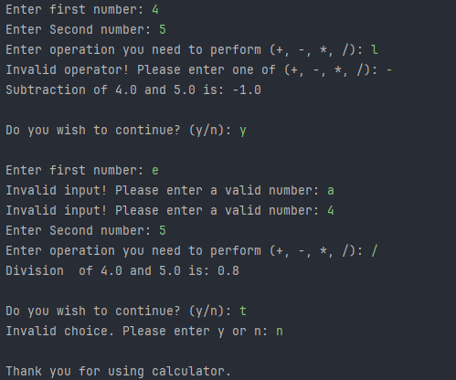

# Java Console Calculator
A simple console calculator in Java using Loops, Conditional Statements and Methods.

---
## Features
- ➕ Addition
- ➖ Subtraction
- ✖️ Multiplication
- ➗ Division *(with divide-by-zero check)*

---

## Concept Used
- Methods
- Loops
- Scanner (Java I/O)
- Conditional Statements (switch-case)
- Input Validation

---

## Tech Stack
- Java (JDK 17+)
- Git & GitHub
- IDE (IntelliJ IDEA)

---

## How to run
1. Clone the repository:
   ```bash
   git clone https://github.com/ArnimTaliyan/elevate-task01-java-calculator.git
   ```
2. Navigate into the project folder and compile:
   ```bash
   javac Calculator.java
   ```
3. Run the program:
   ```bash
   java Calculator
   ```
---

# Output


---

# Learning Outcome
This task helped reinforce Java fundamentals, improved problem-solving skills, and practiced hands-on coding. It also enhanced version control workflow using Git and GitHub.

---

## End Note
This was completed as part of a Java Developer Internship Task at Elevate Labs, focused on building real-world Java development experience from scratch.